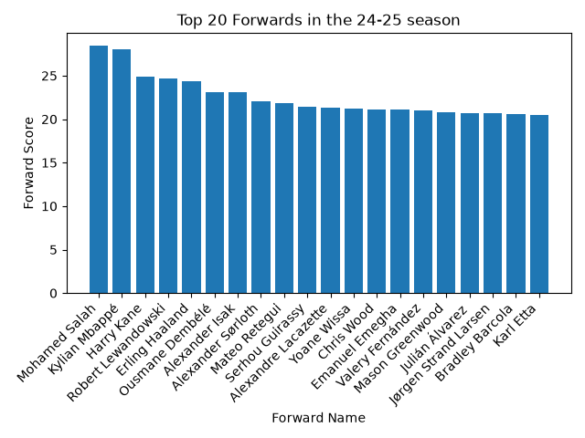
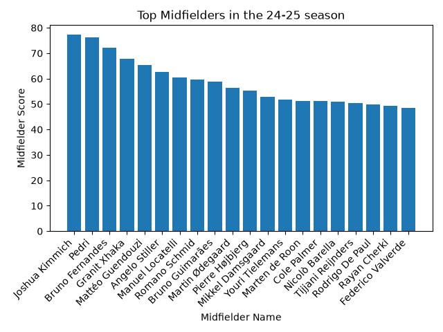
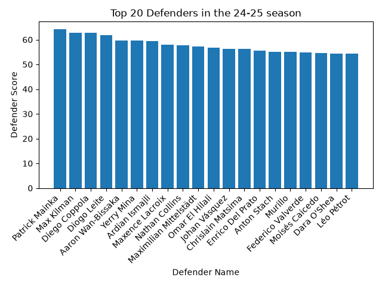
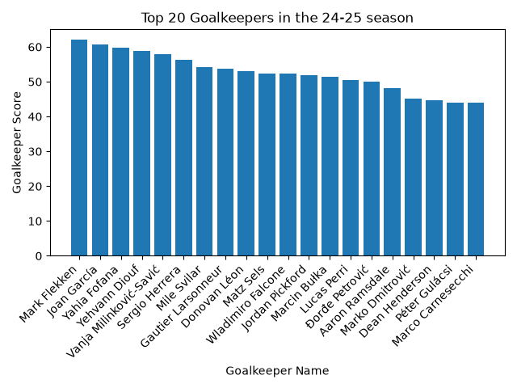
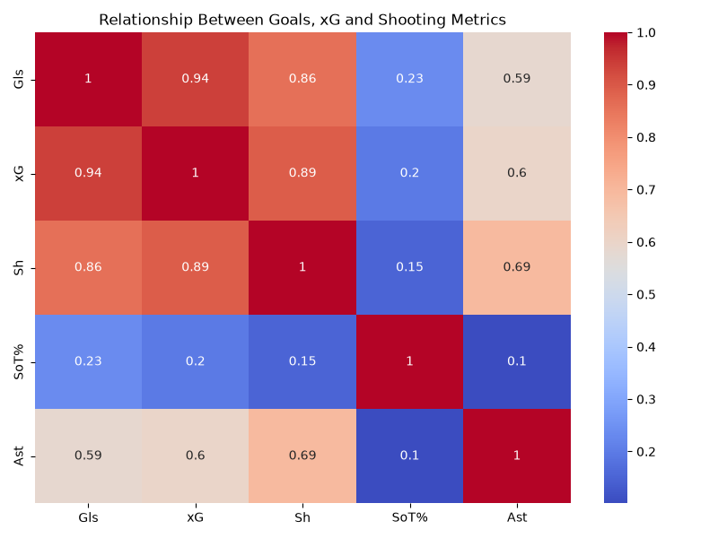
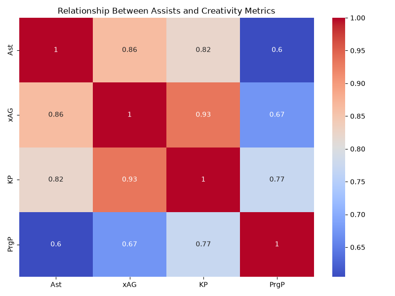
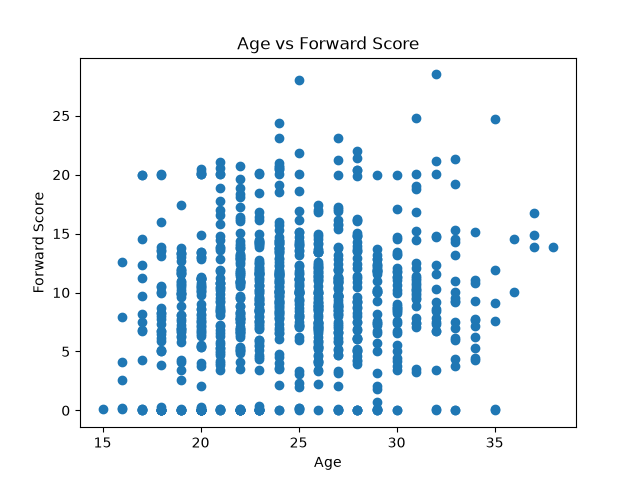
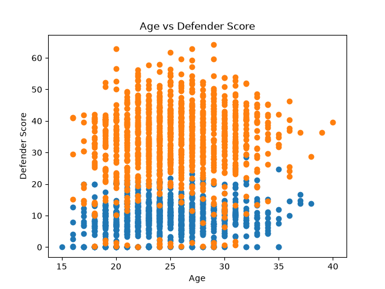

# ⚽ Football Scout Analytics

> A Python-based football analytics project that evaluates player performance across Europe's top football leagues using custom scoring models, statistical analysis, and data visualization.

---

# 📖 Overview

Football Scout Analytics analyzes player statistics from the **2024–25 European football season** to identify elite performers, hidden talents, top clubs, and league trends.

The project uses **Python, Pandas, NumPy, Matplotlib, and Seaborn** to clean data, build custom player ratings, perform statistical analysis, and generate insightful visualizations.

---

# 🚀 Features

* 🧹 Data Cleaning & Preprocessing
* ⚽ Position-wise Player Classification
* ⭐ Custom Performance Rating System
* 📊 Top Player Rankings
* 🌟 Hidden Gem Detection (U-23 Players)
* 🎯 Best Finisher Analysis
* 🏟 Best Attacking & Defensive Club Analysis
* 🌍 Best Attacking & Defensive League Analysis
* 📈 Correlation Heatmaps
* 📉 Age vs Performance Analysis

---

# 🏆 Key Findings

## ⚽ Top Performers

| Category         | Player                         |
| ---------------- | ------------------------------ |
| 🥇 Top Scorer    | **Kylian Mbappé (31 Goals)**   |
| 🎯 Top Playmaker | **Mohamed Salah (18 Assists)** |
| 🔥 Best Finisher | **Patrik Schick**              |

---

## 🌟 Hidden Gems (Under-23)

### ⚡ Forwards

* Emanuel Emegha
* Mason Greenwood
* Bradley Barcola
* Karl Etta
* Dane Scarlett

### 🎯 Midfielders

* Pedri
* Cole Palmer
* Jude Bellingham
* Rayan Cherki
* Florian Wirtz

### 🛡️ Defenders

* Diego Coppola
* Nathan Collins
* Murillo
* Omar El Hilali
* Chrislain Matsima

### 🥅 Goalkeepers

* Joan García
* Yahia Fofana
* Lucas Chevalier
* Zion Suzuki
* Giorgi Mamardashvili

---

## 🏟 Club Analysis

| Category               | Result       |
| ---------------------- | ------------ |
| 🔥 Best Attacking Club | **Atalanta** |
| 🛡 Best Defensive Club | **West Ham** |

---

## 🌍 League Analysis

| Category                 | Result             |
| ------------------------ | ------------------ |
| ⚔️ Best Attacking League | **Premier League** |
| 🧱 Best Defensive League | **La Liga**        |

---

# 📊 Visualizations

## Top 20 Forwards



---

## Top 20 Midfielders



---

## Top 20 Defenders



---

## Top 20 Goalkeepers



---

## Goals vs Expected Goals Correlation



---

## Creativity Metrics Correlation



---

## Age vs Forward Performance



---

## Age vs Defender Performance



---

# 📂 Dataset

**Source:** FBref Player Statistics (2024–25 Season)

The dataset includes:

* Goals
* Assists
* Expected Goals (xG)
* Expected Assists (xAG)
* Progressive Passes
* Tackles
* Blocks
* Interceptions
* Saves
* Clean Sheets
* Shot Accuracy
* Age
* Position
* Club
* League

---

# 🛠 Technologies Used

* Python
* Pandas
* NumPy
* Matplotlib
* Seaborn

---

# ▶️ How to Run

Clone the repository

```bash
git clone https://github.com/kavishdalal1/Football-scout.git
```

Install dependencies

```bash
pip install -r requirements.txt
```

Run the project

```bash
python main.py
```

---

# 📁 Project Structure

```text
Football-scout/

├── main.py
├── README.md
├── requirements.txt
├── top_forwards.png
├── top_mf.png
├── top_def.png
├── top_gk.png
├── xg_goals_heatmap.png
├── assists_heatmap.png
├── age_vs_forward_score.png
├── age_vs_defender_score.png
```

---


# 👨‍💻 Author

**Kavish Dalal**

Second-Year B.Tech Student

**Interests**

* ⚽ Football Analytics
* 📊 Data Analytics
* 🐍 Python
* 🤖 Machine Learning

---

⭐ **If you found this project interesting, consider giving the repository a star!**
